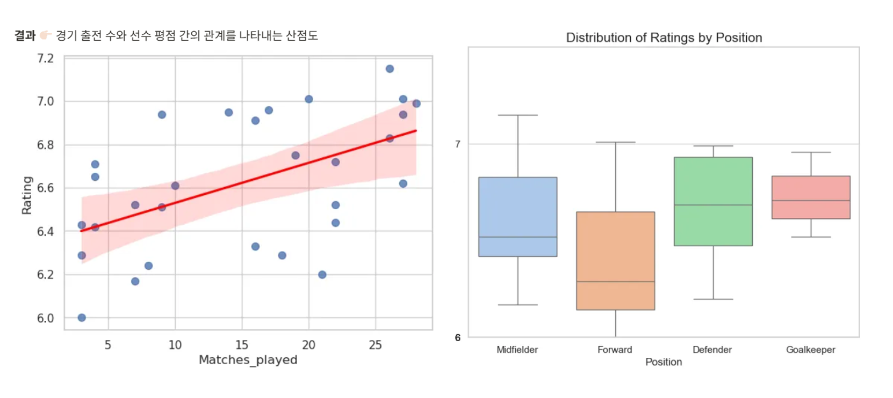

# Python Project: 인기 점수와 실력 점수 간의 상관 관계 확인

	

  

 
 
 

## 1. 토트넘 축구 선수들의 인기와 실력은 비례하는가?

 

 

**✔️ 상관계수는 0.14로, 두 변수 간의 상관관계가 거의 없음을 의미함
  즉, 실력이 좋다고 해서 반드시 인기가 많은 것은 아님**
 	

- 예외 1. 실력 점수가 185.90 인 손흥민은 인기 점수 또한 100 정도로 매우 높으나  
	실력 점수가 187.38 인 쿨루셉스키의 인기 점수는 5 정도로 매우 낮음

- 예외 2. 히샬리송 선수는 시즌 초 부상 등의 영향으로 실력 점수 58.59 를 기록했으나  
	실력 점수 189.27 인 부주장 매디슨과 동일한 인기 점수를 기록함
 
 
 

## 2. 토트넘 경기 부진 원인 분석

**✔️ 최근 부진했던 원인으로 수비 중심의 경기 운영, 
     낮은 골 결정력 등을 유추해 볼 수 있음**
  
- 최고 평점(손흥민, 7.15)은 미드필더, 최저 평점(랭크셔, 6.0)은 공격수가 기록함   
- 포지션별 평균 평점은 Goalkeeper > Defender > Midfielder > Forward 순으로 높음   
- 특히 미드필더, 공격수들은 선수 간 기량 차이가 극명하게 나타는 것을 확인할 수 있음   
- 수비수, 골키퍼들은 평균 경기력이 우수한 편인 반면 미드필더, 공격수들은 상대적으로 낮은 평균 평점을 받음 
